# Quantum Computing Study Suite


A self-contained desktop learning suite for quantum computing — from mathematical
foundations through hardware-level error correction, variational algorithms, and
IBM's **C1000-179** Qiskit developer certification. Ten PyQt6 apps drill, quiz, grade
and time you; a 58-file teaching corpus, twelve lesson plans, nine executable notebooks,
five hardware labs and five capstone projects supply the material; two console tools
read every app's history and tell you what to study next.

Everything runs locally. Three apps (flashcard-drill, exam-sim, qiskit-dojo) are fully
usable offline and four more (qec-trainer, vqa-trainer, circuit-trainer, problem-trainer)
work offline for everything except free-form grading; the Claude API (`claude-sonnet-4-6`)
powers question generation and open-ended grading, and every app still launches — with
its offline features, Reference browser and history intact — when no key is configured.

---

## Features

### The ten apps

| App | What it trains | Offline | Needs |
|---|---|---|---|
| [flashcard-drill](flashcard-drill/) | Recall — 550 SRS flashcards in 14 categories (Paulis, gate unitaries, theorems, QEC, Qiskit API, …) | Fully | — |
| [exam-sim](exam-sim/) | Exam conditions — 110-question C1000-179 bank; 68 Q / 90 min mocks scored against the 47/68 bar, 10-minute section sprints, missed-question review, score-trend history | Fully | — |
| [qiskit-dojo](qiskit-dojo/) | Writing real Qiskit 2.x code — 36 katas in 10 sections (incl. debugging and API-modernization drills), executed in a subprocess and graded by assertions | Fully (Claude style review optional) | Qiskit |
| [qec-trainer](qec-trainer/) | Error correction — 178 problems in 6 categories (170 auto-graded MC, 8 free-form) plus a syndrome-decoder game up to the distance-3 surface code | MC + decoder game | Key for 8 free-form |
| [vqa-trainer](vqa-trainer/) | Variational algorithms — 179 problems in 7 categories (153 MC, 7 exact-numeric, 19 free-form): VQE, parameter shift, QAOA, ansätze, barren plateaus, mitigation, optimal control | MC + numeric | Key for 19 free-form |
| [circuit-trainer](circuit-trainer/) | Circuit arithmetic — problems generated with Qiskit (`quantum_info` Statevector/Operator) in 12 categories (state output, measurement probabilities, identities, unitaries, entanglement, noise, …) with rendered circuits; sprint mode (10 rapid-fire questions, 60-second countdown each) | Everything except free-form explanations | Qiskit; key for explanations |
| [problem-trainer](problem-trainer/) | Long-form problem solving — 16 multi-part textbook problems graded against rubrics, plus 7 Socratic guided derivations (QPE, Grover count, CHSH, no-cloning, teleportation, parameter shift, threshold) | Model solutions and steps | Key for grading |
| [quantum-quiz](quantum-quiz/) | Open-ended QC theory — Claude-generated questions across 11 subjects / 124 topics with Qiskit-rendered context, 7 question types incl. teach-back (Feynman) and viva follow-ups | Reference + history | Key, Qiskit |
| [math-quiz](math-quiz/) | The mathematics underneath — 13 subjects / 197 topics from linear algebra to topology, generated and graded by Claude with hints | Reference + history | Key |
| [paper-drill](paper-drill/) | Active reading — paste any paper; Claude writes factual / conceptual / derivation questions and grades your answers; saved-paper library | Library + history | Key |

Every app has an in-app **Reference** button that renders the whole `docs/` corpus, and
every trainer has a **⚑ Flag for review** toggle whose flags feed the suite-wide review
queue (`python coach.py --review`). exam-sim is the exception: its in-exam "Flag for
review" button only marks a question to return to during the mock and is never persisted;
missed exam questions reach the review queue automatically via `exam_missed.json`.

### The content packs

| Pack | Contents |
|---|---|
| [docs/](docs/) | 58 chapter files in 8 chapters — the learning ladder from linear algebra to QSVT. Every file closes with the same five sections — Key Formulas, a Worked Example, a Summary, Exercises with collapsible solutions, and Further Reading. Chapter 1 now includes six extended-mathematics files (groups and abstract algebra, representation theory, probability and statistics, number theory and Fourier analysis, analysis for QM, topology and geometry). |
| [lesson-plans/](lesson-plans/) | 12 structured curricula — linear algebra through transpiling, plus the C1000-179 certification track (5-week schedule) and the paper-reading ladder. Qiskit snippets verified on Qiskit 2.5.2. |
| [notebooks/](notebooks/) | 9 executable companions — one per docs chapter reproducing its worked examples with assertions, plus an Aer noise-model lab (T₁, Ramsey, randomized benchmarking). |
| [labs/](labs/) | 5-lab IBM Quantum runtime track — first job, Sessions vs Batch, reading calibration data, error suppression, a full hardware VQE workflow. |
| [projects/](projects/) | 5 capstone specs with milestones — VQE for H₂, a custom transpiler pass, a Steane-code simulator, BB84 with an eavesdropper, Grover on 3-SAT. |

### The console tools

| Tool | Purpose |
|---|---|
| `python coach.py` | Daily prescription from cross-app history: weakest categories, due reviews, a kata, a sprint. `--diagnostic` (placement quiz), `--review` (unified review queue: flags + missed exam questions + low scores), `--badges` (IBM Quantum Learning tracker). |
| `python dashboard.py` | Raw mastery report per app, weakest topics, recent activity, streak. |
| `python tools/verify_docs.py` | Regression gate for the corpus: structure, lint, cross-references, README file maps, lesson-plan snippet execution. |

<details>
<summary><b>Screenshots</b> — the launcher and all ten apps</summary>

| | |
|---|---|
| **Launcher** (`python launch.py`)<br>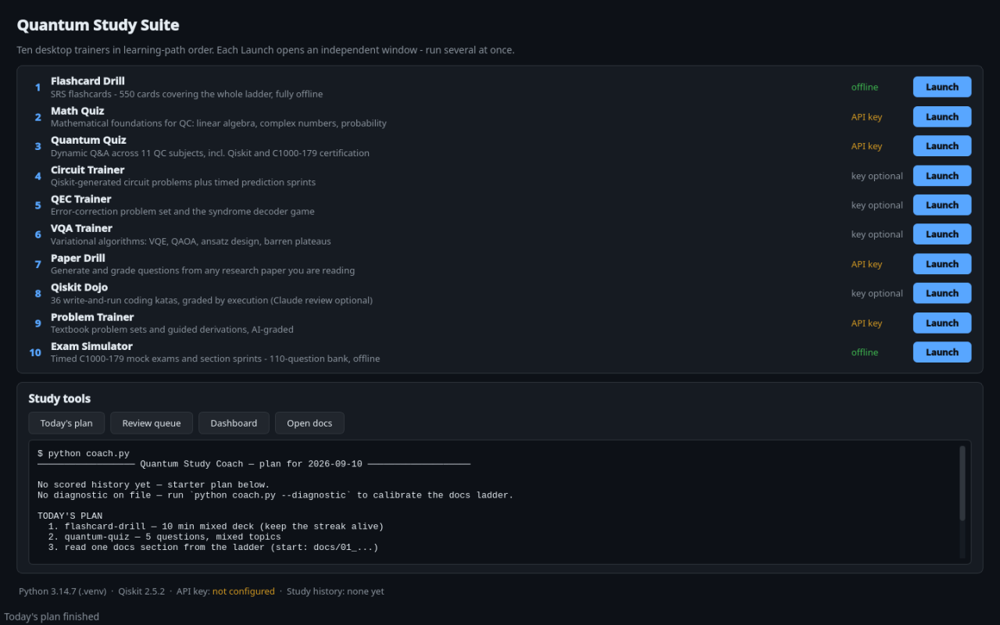 | **flashcard-drill**<br>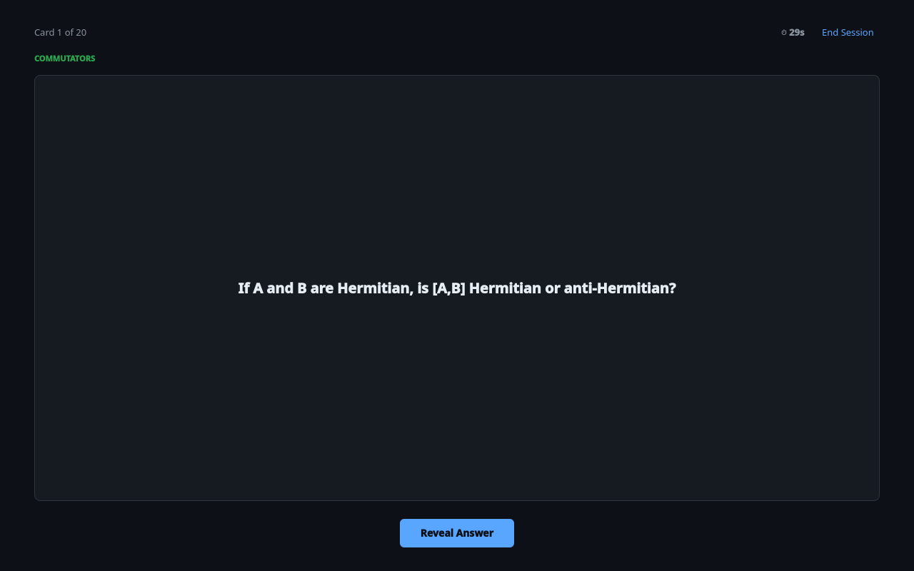 |
| **exam-sim**<br>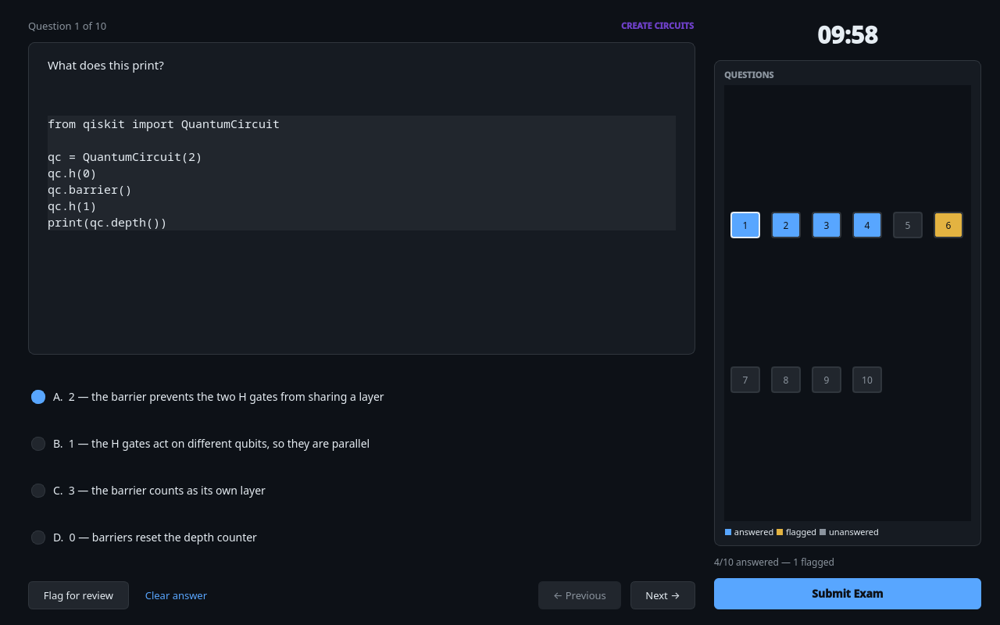 | **qiskit-dojo**<br>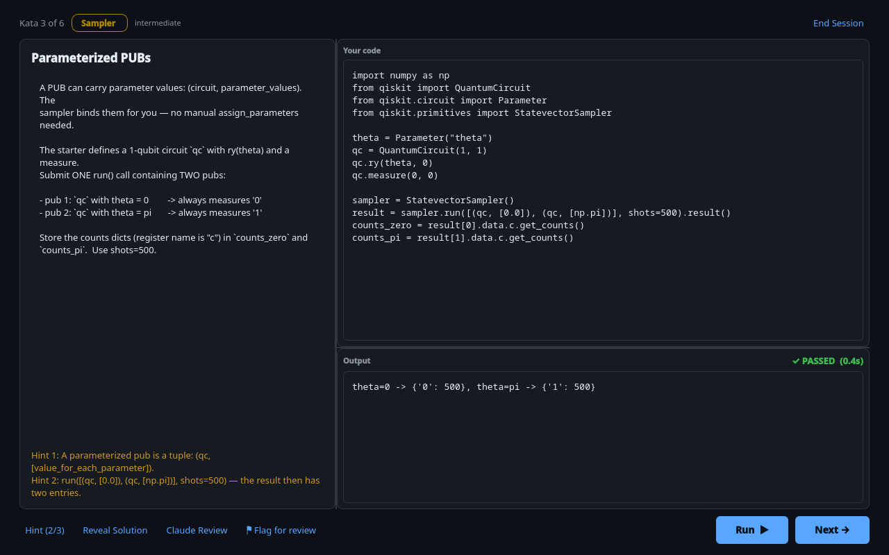 |
| **qec-trainer**<br>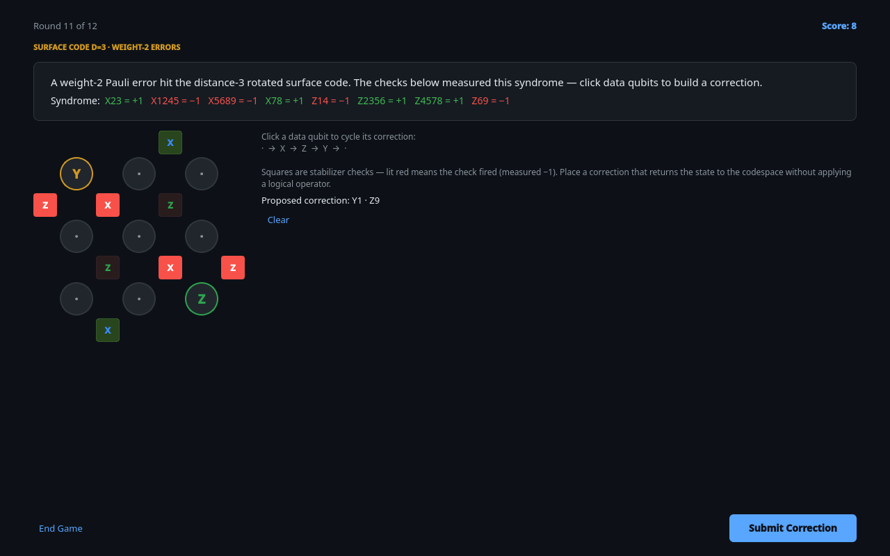 | **vqa-trainer**<br>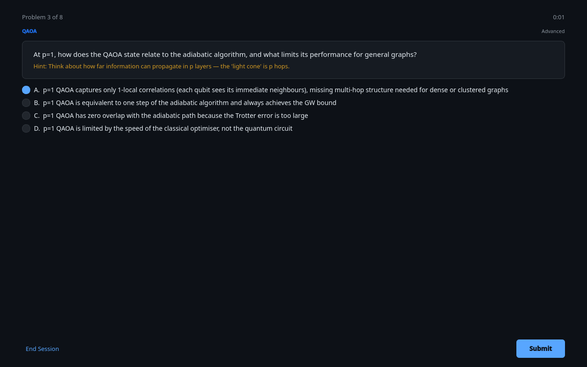 |
| **circuit-trainer**<br>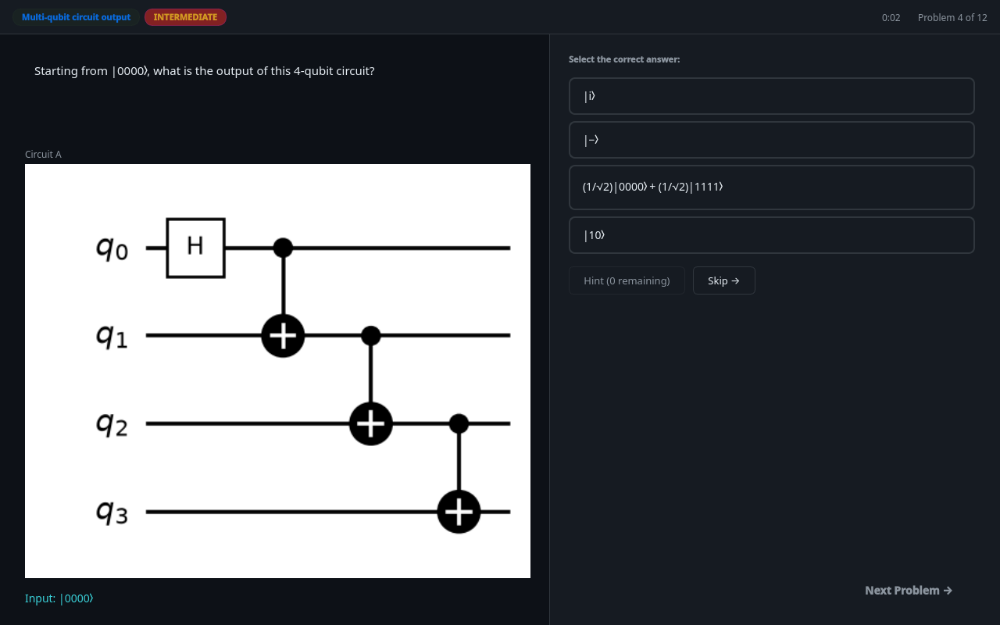 | **problem-trainer**<br>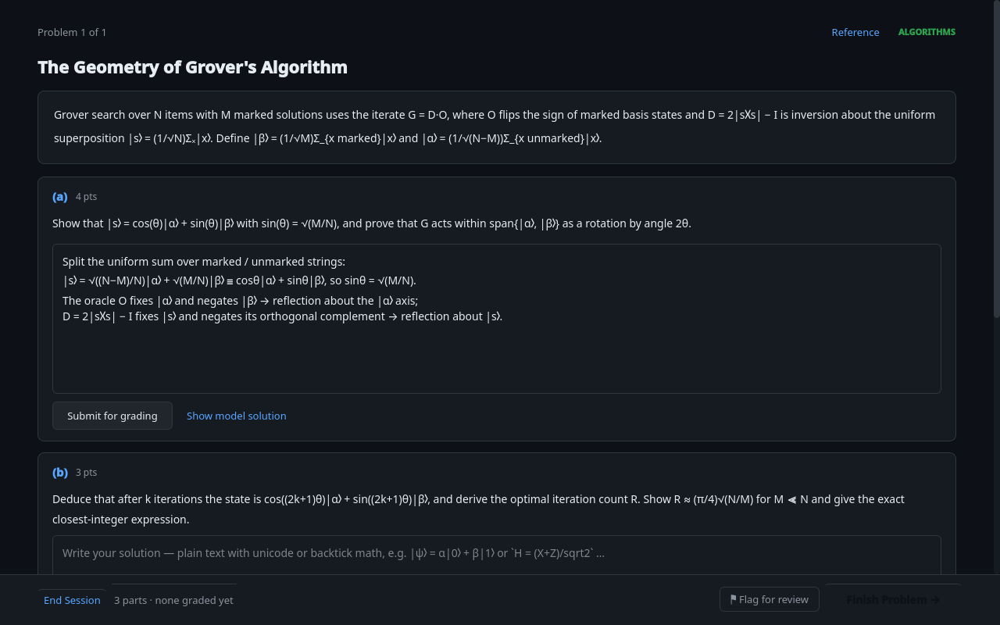 |
| **quantum-quiz**<br>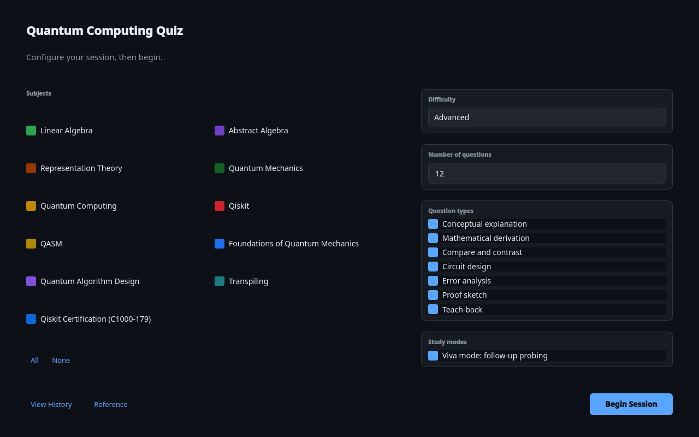 | **math-quiz**<br>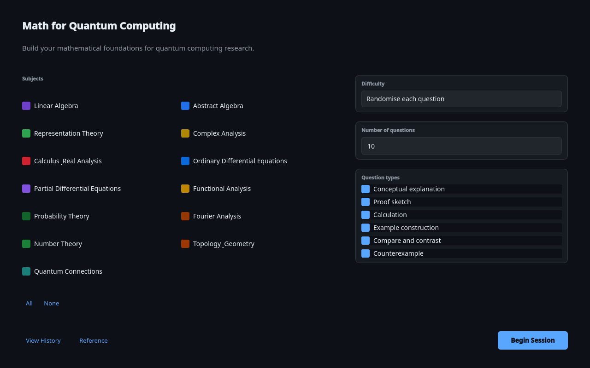 |
| **paper-drill**<br>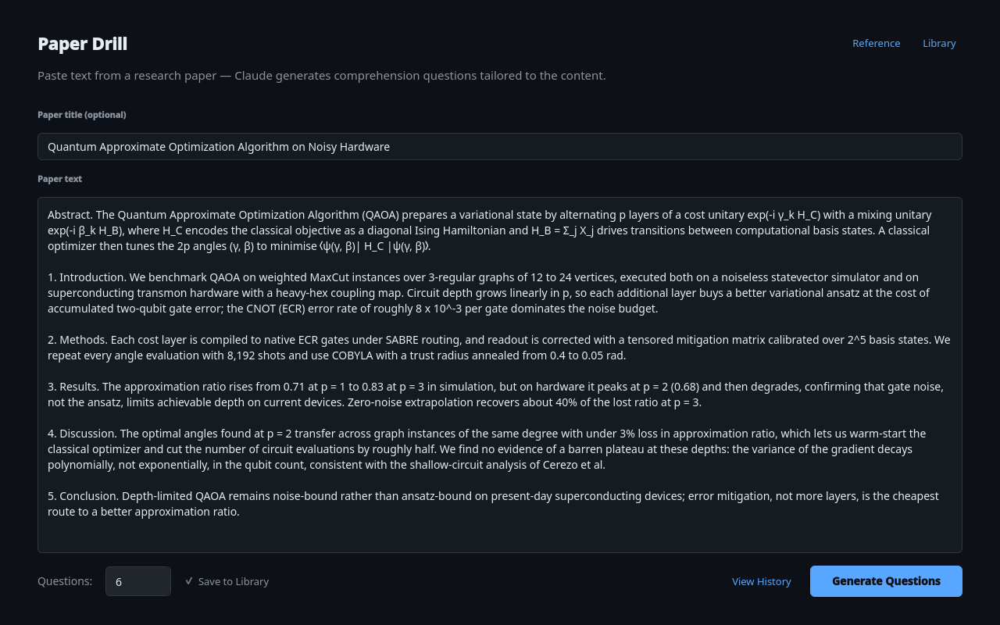 | |

</details>

---

## Quick Start

### Prerequisites

Python **3.12+** recommended — CI runs 3.12 and 3.14 (developed on 3.14) and the
current numpy/scipy wheels require 3.12. `setup.sh` accepts **3.11** as its minimum, but
3.11 is untested and depends on pip resolving older numpy/scipy. A desktop session for
the PyQt6 windows. On a minimal Linux install PyQt6 also needs the Qt runtime
libraries (Debian/Ubuntu: `libxcb-cursor0 libegl1 libgl1 libxkbcommon0`; Fedora:
`xcb-util-cursor mesa-libEGL mesa-libGL libxkbcommon`) — `setup.sh` prints that line if
they are missing. Everything else is a Python package that the setup script installs.

### 1. Set up

```bash
git clone https://github.com/matthewscottconroy/quantum-computing-study-suite.git
cd quantum-computing-study-suite
./setup.sh            # creates .venv, installs requirements.txt, checks core imports, imports every app headless
```

`./setup.sh --dev` additionally installs `requirements-dev.txt` (pytest, Jupyter kernel
and notebook execution deps) for contributors.

### 2. Launch

```bash
source .venv/bin/activate
python launch.py                  # graphical launcher — pick an app
python launch.py flashcard-drill  # or start one app directly by directory name ...
python launch.py dojo             # ... or by alias / unique prefix
python launch.py --list           # the app table: names, aliases, which apps use a key for their full feature set
```

`flashcard-drill`, `exam-sim` and `qiskit-dojo` work immediately with no key.

### 3. (Optional) API key for the Claude-powered features

API apps look for the key in two places, in order:

1. Environment variable: `export ANTHROPIC_API_KEY=sk-ant-...`
2. File: `~/.config/quantum-study/api_key.txt`

The file approach persists across terminal sessions without modifying shell config:
```bash
mkdir -p ~/.config/quantum-study
echo "sk-ant-..." > ~/.config/quantum-study/api_key.txt
```

Every app launches without a key; only generation, grading and review buttons need it,
and they report a clear error rather than crashing.

### Manual per-app fallback

Each app is a standalone Python package and can be run on its own. From the repo root:

```bash
python -m venv .venv && source .venv/bin/activate
pip install -r requirements.txt   # or one app's: pip install -r quantum-quiz/requirements.txt
cd quantum-quiz && python main.py
```

Minimum dependency tiers if you install by hand: `PyQt6` for every app (plus `matplotlib`
for all but problem-trainer); `anthropic` for the Claude features; `qiskit` + `pylatexenc`
for quantum-quiz, circuit-trainer and the qiskit-dojo execution harness (plus
`qiskit-qasm3-import` for the dojo's OpenQASM kata, which calls `qiskit.qasm3.loads`);
`qiskit-aer` for the Aer katas in qiskit-dojo, the notebooks and the labs;
`qiskit-ibm-runtime` only for the hardware labs — the lesson-plan snippets that import it
are skipped automatically by `verify_docs.py`, so the docs gate does not need it.
`qiskit-dojo` finds the interpreter for its sandbox automatically (the active venv →
`../.venv/bin/python` → `qiskit-dojo/.venv/bin/python` → `sys.executable`), so keep the
shared `.venv` if you use it.

---

## Recommended Learning Path

```
1. lesson-plans          Read the relevant curriculum first
         │
         ▼
2. flashcard-drill       No setup — drill core identities and theorems
         │
         ▼
3. math-quiz             Build mathematical foundations (API needed)
         │
         ▼
4. quantum-quiz          Full QC theory + Qiskit questions (API + Qiskit)
         │
         ├──► circuit-trainer   Hands-on circuit arithmetic (Qiskit; API for explanations)
         │
         ├──► qec-trainer       Error correction focus (API for free-form only)
         │
         ├──► vqa-trainer       Variational algorithms focus (API for free-form only)
         │
         └──► paper-drill       Test understanding of a specific paper (API)

Production-skill track (alongside the above):
   qiskit-dojo      Write real Qiskit code, graded by execution
   problem-trainer  Long-form problems and guided derivations (API for grading)
   exam-sim         Timed mock exams for C1000-179 (offline)
   notebooks/ labs/ projects/   Executable examples, hardware labs, capstones

Daily driver:  python coach.py   — prescribes today's session from your history
```

The docs ladder in [docs/README.md](docs/README.md) (Rung 1 → 8) gives the reading order
and per-chapter time estimates; [GETTING_STARTED.md](GETTING_STARTED.md) turns the whole
thing into a day-1 routine and a certification track.

---

## Running the tests

```bash
source .venv/bin/activate          # after ./setup.sh --dev
bash tools/run_tests.sh            # every suite: root console tools + each app, in its own pytest process
```

Individually:

```bash
pytest                                   # root suite: coach.py, dashboard.py, launch.py, tools/verify_docs.py
(cd qec-trainer && python -m pytest)     # one app; each app has tests/ and its own pytest.ini
(cd qiskit-dojo && python -m pytest -m slow tests/test_sweep.py)  # opt-in: run all 36 kata solutions
python tools/verify_docs.py --all        # docs/lesson-plan regression gate (--no-snippets without the venv)
for nb in notebooks/*.ipynb; do MPLBACKEND=Agg jupyter execute "$nb"; done   # notebooks, executed in memory as CI does (--inplace would rewrite them with outputs)
```

Apps must run in separate pytest processes because several share top-level package names
(`core/`, `problems/`, `ui/`); `tools/run_tests.sh` handles that. Tests marked `slow` (more
than ~30 s) are deselected by default. Headless runs set `QT_QPA_PLATFORM=offscreen`, and
every test suite points `QUANTUM_STUDY_DATA_DIR` at a temporary directory (and monkeypatches
the path constants of the apps that do not read the variable) so nothing touches your real
study history.

CI ([`.github/workflows/ci.yml`](.github/workflows/ci.yml)) runs the same sequence on
Python 3.12 and 3.14 — byte-compile, an import smoke test of every app with no API key,
`python tools/verify_docs.py --all`, then `bash tools/run_tests.sh`. A second workflow
([`notebooks.yml`](.github/workflows/notebooks.yml)) executes every notebook on every push
and pull request to `main`, weekly, and on manual dispatch, which doubles as a regression
check on the numbers printed in `docs/`.

---

## Shared Data Directory

All apps that record history write to `~/.local/share/quantum-study/`. Files are plain JSON
and are never deleted automatically. The `QUANTUM_STUDY_DATA_DIR` environment variable
redirects that directory for `coach.py`, `launch.py`, flashcard-drill, qiskit-dojo,
math-quiz and quantum-quiz; circuit-trainer, exam-sim, paper-drill, problem-trainer,
qec-trainer, vqa-trainer and `dashboard.py` do not read it yet and always use the default
path, so do not rely on the variable to sandbox a whole session.

| File | Written by |
|---|---|
| `flashcard_history.json`, `flagged_cards.json` | flashcard-drill |
| `qec_history.json`, `qec_flagged.json` | qec-trainer |
| `vqa_history.json`, `vqa_flagged.json` | vqa-trainer |
| `paper_history.json`, `paper_library.json`, `paper_flagged.json` | paper-drill |
| `quiz_history.json`, `quiz_draft.json`, `quiz_flagged.json` | quantum-quiz |
| `math_history.json`, `math_draft.json`, `math_flagged.json` | math-quiz |
| `trainer_history.json`, `trainer_flagged.json` | circuit-trainer |
| `dojo_history.json`, `dojo_flagged.json` | qiskit-dojo |
| `exam_history.json`, `exam_missed.json` | exam-sim |
| `problems_history.json`, `problems_flagged.json` | problem-trainer |
| `coach_state.json` | coach.py |

The `*_flagged.json` files share one contract — a JSON list of
`{"id", "label", "category", "app", "timestamp"}` entries (only `id` required). Three
legacy files — `flagged_cards.json`, `qec_flagged.json` and `vqa_flagged.json` — still hold
a bare list of id strings instead, so anything that reads these files must accept both
shapes, as `coach.py` does. `coach.py --review` discovers every such file by name, so a new
app joins the review queue just by writing `<prefix>_flagged.json`.

---

## Architecture Notes

All apps follow the same structural pattern (typical layout — the two API-free apps,
flashcard-drill and exam-sim, have no `workers/`; exam-sim has no `ui/widgets/`; and
flashcard-drill keeps persistence in a `persistence/storage.py` package):

```
<app>/
├── main.py               Entry point — creates QApplication and MainWindow
├── config.py             App-wide constants (model, paths, thresholds)
├── core/
│   └── models.py         Dataclasses shared across all modules
├── ui/
│   ├── main_window.py    QMainWindow + QStackedWidget screen controller
│   ├── screens/          One file per screen (setup, problem, feedback, summary, history, reference)
│   ├── widgets/          Reusable widgets (LoadingOverlay, CollapsiblePanel, ScoreBar, etc.)
│   └── theme.py          Colour palette and style constants
├── workers/              QThread subclasses for non-blocking API calls
├── persistence.py        JSON read/write for session history and review flags
├── tests/                pytest suite (+ pytest.ini)
└── requirements.txt
```

Apps with static banks add a one-file-per-item directory that is auto-discovered at start-up:
`flashcard-drill/cards/`, `qec-trainer/problems/`, `vqa-trainer/problems/`,
`qiskit-dojo/katas/`, `exam-sim/bank/`, `problem-trainer/problems/` and `derivations/`.
Where the Claude code lives differs by app family: qec-trainer, vqa-trainer and
circuit-trainer keep `auto_grader.py` beside `claude_grader.py` in `grading/`, and
qiskit-dojo keeps `claude_review.py` there; paper-drill and problem-trainer keep everything
Claude-facing in `ai/` (`client.py`, `grader.py`, and `generator.py` or `prompts.py` +
`response_parser.py`); quantum-quiz and math-quiz keep `prompt_builder.py` and
`response_parser.py` in `ai/` with the client in `core/claude_client.py`. circuit-trainer is the only app
that uses Qiskit to *generate* problems (`problems/<category>.py` generators compute the
answers with `qiskit.quantum_info` — `Statevector` / `Operator` — not Aer).
See [CONTRIBUTING.md](CONTRIBUTING.md) for the object shape of each bank item.

---

## Claude Model

All API apps use `claude-sonnet-4-6`. The model ID is set in each app's `config.py`
and can be changed there without touching any other code.

---

## Contributing

Bug reports, corrections to the content banks and new problems are welcome — see
[CONTRIBUTING.md](CONTRIBUTING.md) for the dev setup, the shape of each bank item, the
docs style rules and the PR checklist, and [CODE_OF_CONDUCT.md](CODE_OF_CONDUCT.md).
Released under the [MIT License](LICENSE).

> The exam logistics quoted for C1000-179 (68 questions, 90 minutes, 47 to pass, section
> weights) are third-party-sourced; confirm them on IBM's official exam page. All exam-sim
> questions are original study material — not real exam content — and this project is not
> affiliated with or endorsed by IBM.
